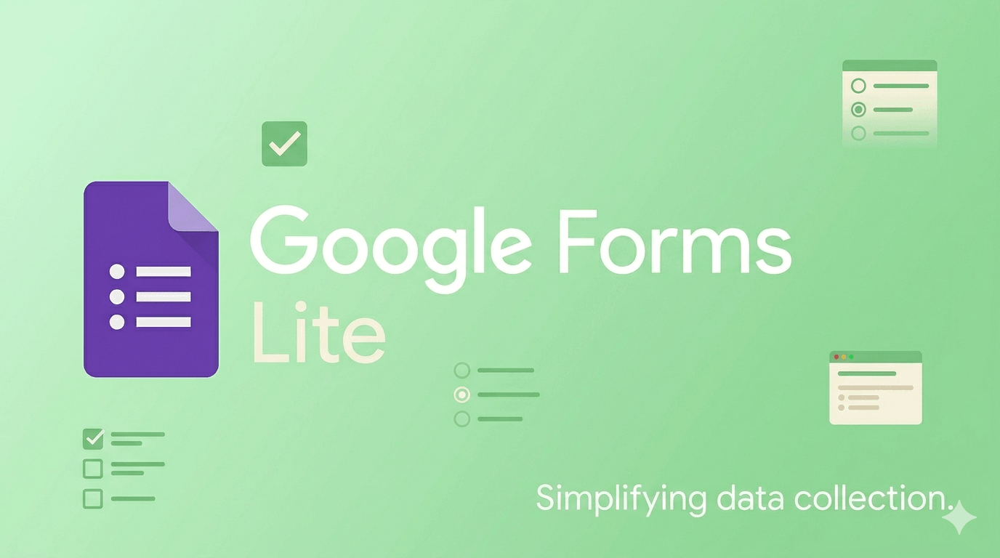

<div align="center">



<br/>

# Google Forms Lite Clone

### Lightweight form builder and response tracker in a monorepo architecture

_Built with React, TypeScript, Redux Toolkit, RTK Query, GraphQL, and Node.js._

[](https://github.com/NadiiaSavchuk2210/forms-clone)
[](https://react.dev/)
[](https://www.typescriptlang.org/)
[](https://redux-toolkit.js.org/)
[](https://graphql.org/)
[](https://www.apollographql.com/docs/apollo-server/)
[](https://vite.dev/)
[](#project-structure)
[](#notes)

</div>

---

<a id="at-a-glance"></a>

## ✨ At a Glance

| Area              | Details                                                 |
| :---------------- | :------------------------------------------------------ |
| Frontend          | React, TypeScript, Vite, Redux Toolkit, RTK Query       |
| Backend           | Node.js, Apollo Server, GraphQL                         |
| Monorepo Packages | `client`, `server`, `shared`                            |
| Main Flows        | Create form, fill form, submit response, review results |
| Data Storage      | In-memory store for the lifetime of the running server  |

<a id="live-links"></a>

## 🌐 Live Links

- **Frontend:** [add-your-vercel-url-here](https://forms-clone-client.vercel.app)
- **Backend:** [add-your-render-url-here](https://forms-clone-api.onrender.com)

<a id="project-overview"></a>

## 📌 Project Overview

**Google Forms Lite Clone** is a training full-stack monorepo project that recreates the essential Google Forms workflow:

- create a form
- add and manage questions
- fill out a form
- submit answers
- review collected responses

The repository is intentionally split into separate workspaces for the client and the server, with a shared package for common TypeScript contracts.

> [!IMPORTANT]
> Server data is stored in memory only. Forms and responses are available while the server is running and are reset after restart.

---

<a id="contents"></a>

## 🧭 Contents

- [📌 Project Overview](#project-overview)
- [🚀 Core Features](#core-features)
- [🌐 Live Links](#live-links)
- [🗂 Project Structure](#project-structure)
- [💻 Tech Stack](#tech-stack)
- [🎯 Deliverables](#deliverables)
- [⚙️ Local Setup](#local-setup)
- [🛠 Available Scripts](#available-scripts)
- [🔗 GraphQL API Summary](#graphql-api-summary)
- [🧬 GraphQL Code Generation](#graphql-code-generation)
- [🧪 Testing and Validation](#testing-and-validation)
- [📝 Notes](#notes)
- [👩‍💻 Author](#author)

---

<a id="core-features"></a>

## 🚀 Core Features

### 🧱 Form Builder

- Create a form with title and description
- Add `TEXT`, `MULTIPLE_CHOICE`, `CHECKBOX`, and `DATE` questions
- Add and remove options for choice-based questions
- Reorder questions visually
- Validate form data before saving

### 📝 Form Filling

- Load a form by id
- Render the correct field type for each question
- Submit answers through GraphQL mutations
- Show success and error feedback
- Preserve drafts locally while completing the form

### 📊 Responses Review

- Fetch all responses for a selected form
- Map answers back to their original questions
- Present submitted answers in a readable format
- Show aggregated response summary data

### 🏗 Architecture Highlights

- Monorepo with `client`, `server`, and `shared` packages
- RTK Query with GraphQL code generation
- Apollo Server GraphQL API
- Shared TypeScript types across packages
- Unit tests for critical logic on both client and server

---

<a id="project-structure"></a>

## 🗂 Project Structure

```text
forms-clone/
├── client/                        # React + Vite frontend
│   ├── public/                    # Favicons and Open Graph image
│   └── src/
│       ├── app/                   # Providers, router, store
│       ├── entities/              # Form and response entities
│       ├── features/              # Theme switching
│       ├── pages/                 # Home, builder, filler, responses
│       ├── shared/                # API layer, ui, utils, validation
│       └── widgets/               # Header, forms list
├── server/                        # GraphQL API server
│   └── src/
│       ├── database.ts            # In-memory store
│       ├── resolvers.ts           # GraphQL resolvers
│       ├── schema.ts              # GraphQL schema
│       └── utils/validation.ts    # Server-side validation
├── shared/                        # Shared TypeScript types and constants
└── README.md
```

---

<a id="tech-stack"></a>

## 💻 Tech Stack

- **Front-End:** React, TypeScript, Vite, React Router, Redux Toolkit, RTK Query
- **Back-End:** Node.js, Apollo Server, GraphQL
- **Shared Package:** reusable domain types and validation constants
- **Styling:** CSS Modules
- **Testing:** Vitest on the client, Node test runner on the server

---

<a id="deliverables"></a>

## 🎯 Deliverables

- **Git repository:** [github.com/NadiiaSavchuk2210/forms-clone](https://github.com/NadiiaSavchuk2210/forms-clone)
- **Root README:** this file contains setup instructions, local run commands, project overview, core features, and author information

---

<a id="local-setup"></a>

## ⚙️ Local Setup

### Requirements

- Node.js `20+`
- npm `10+`

### 1. Clone the repository

```bash
git clone https://github.com/NadiiaSavchuk2210/forms-clone.git
cd forms-clone
```

### 2. Install dependencies

Install all workspace dependencies from the repository root:

```bash
npm install
```

### 3. Start both client and server together

From the root of the monorepo:

```bash
npm run dev
```

This command runs:

- `server` on `http://localhost:4000/graphql`
- `client` on `http://localhost:5173`

### 4. Run each workspace separately if needed

Start the GraphQL server only:

```bash
npm run dev -w server
```

Start the React client only:

```bash
npm run dev -w client
```

### 5. Optional client API URL override

The client uses:

```bash
VITE_API_URL
```

If it is not provided, the default API URL is:

```bash
http://localhost:4000/graphql
```

---

<a id="available-scripts"></a>

## 🛠 Available Scripts

Run these commands from the repository root:

```bash
npm run dev
npm run build
npm run test
npm run type-check
npm run codegen
```

What they do:

- `npm run dev` starts the client and server concurrently
- `npm run build` builds `shared`, `server`, and `client`
- `npm run test` runs server and client tests
- `npm run type-check` runs TypeScript checks in all workspaces
- `npm run codegen` regenerates GraphQL types and RTK Query endpoints for the client

---

<a id="graphql-api-summary"></a>

## 🔗 GraphQL API Summary

### Queries

- `forms`
- `form(id: ID!)`
- `responses(formId: ID!)`

### Mutations

- `createForm(title: String!, description: String, questions: [QuestionInput!]!)`
- `submitResponse(formId: ID!, answers: [AnswerInput!]!)`

### Main domain types

- `Form`
- `Question`
- `Response`
- `Answer`

---

<a id="graphql-code-generation"></a>

## 🧬 GraphQL Code Generation

The client uses GraphQL code generation for typed operations and RTK Query hooks.

Source files:

- GraphQL operations: `client/src/shared/api/graphql/forms.graphql`
- GraphQL schema: `server/src/schema.ts`

Regenerate client API types after changing the schema or GraphQL documents:

```bash
npm run codegen
```

---

<a id="testing-and-validation"></a>

## 🧪 Testing and Validation

Implemented checks:

- GraphQL resolver tests on the server
- RTK Query and business-logic tests on the client
- Monorepo type-check
- Production build verification

Run all checks:

```bash
npm run test
npm run type-check
npm run build
```

---

<a id="notes"></a>

## 📝 Notes

- No authentication is implemented, as required by the task
- Data is stored in memory only
- The monorepo contains an additional `shared` package to keep client and server types aligned

---

<a id="author"></a>

## 👩‍💻 Author

**Nadiia Savchuk**  
Frontend Developer

[](https://github.com/NadiiaSavchuk2210)
